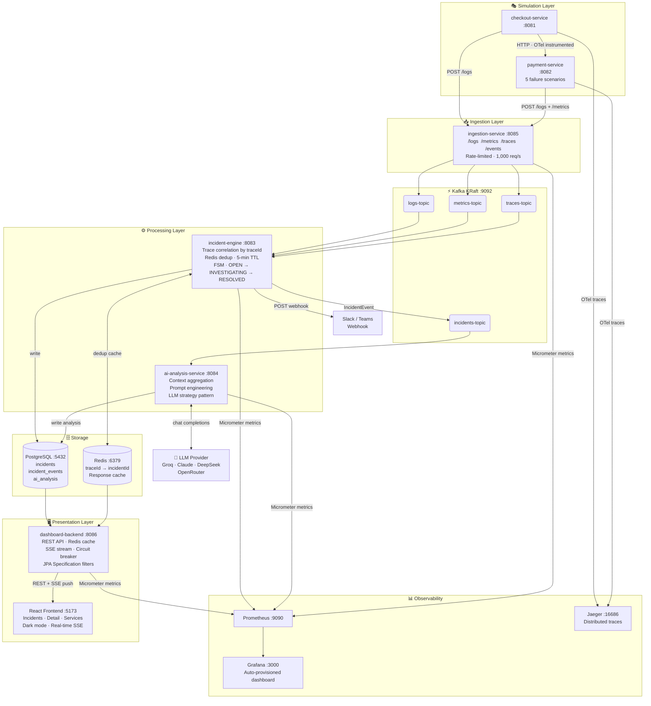
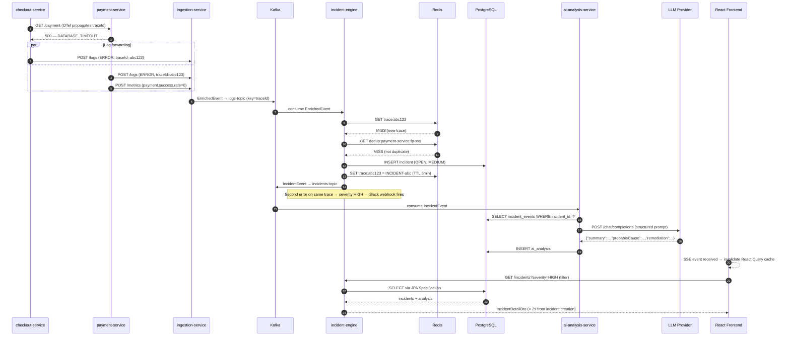

# rootLens

> AI-powered observability platform — distributed trace correlation, LLM root cause analysis, real-time incident dashboard.


rootLens ingests logs, traces, and metrics from microservices, automatically correlates related errors into incidents using distributed trace IDs, and generates AI root cause analysis via pluggable LLM providers (Groq, Claude, DeepSeek). Results stream to a real-time React dashboard via SSE push.

---

## Table of Contents

1. [Quick Start](#quick-start)
2. [Architecture](#architecture)
3. [Data Flow](#data-flow)
4. [Low Level Design](#low-level-design)
5. [Kafka Topics](#kafka-topics)
6. [Database Schema](#database-schema)
7. [REST API Reference](#rest-api-reference)
8. [LLM Provider Configuration](#llm-provider-configuration)
9. [Generating Incidents](#generating-incidents)

---

## Quick Start

**Prerequisites:** Docker + Docker Compose · Java 17 · Node.js 18+ · A free [Groq API key](https://console.groq.com) (no credit card)

```bash
# 1. Export your LLM credentials
export GROQ_API_KEY=your-key-here
export AI_PROVIDER=groq

# 2. Start all backend services
cd infra
docker compose up -d

# 3. Start the frontend
cd ../frontend
npm install && npm run dev
```

| Interface | URL |
|---|---|
| React Dashboard | http://localhost:5173 |
| Dashboard REST API + Swagger | http://localhost:8086/swagger-ui.html |
| Kafka UI | http://localhost:8080 |
| Jaeger Traces | http://localhost:16686 |
| Grafana | http://localhost:3000 |
| Prometheus | http://localhost:9090 |

```bash
# Generate incidents (checkout auto-triggers every 30s in Docker, or manually:)
for i in {1..10}; do curl -s http://localhost:8081/checkout; done
```

Incidents appear on the dashboard within **<2 seconds** of generation via SSE push. AI analysis follows within **~10 seconds**.

---

## Architecture



---

## Data Flow



---

## Low Level Design

### 1. Simulation Services

Both services are Spring Boot apps instrumented with the OpenTelemetry Java agent, propagating trace IDs via W3C TraceContext headers.

**payment-service (:8082)** — 5 weighted failure scenarios:

| Scenario | Probability | Latency |
|---|---|---|
| SUCCESS | 65% | 80–300ms |
| DATABASE_TIMEOUT | 15% | 1.2–4.5s |
| PAYMENT_GATEWAY_UNAVAILABLE | 8% | 1.2–4.5s |
| FRAUD_DETECTION_TRIGGERED | 7% | 1.2–4.5s |
| IDEMPOTENCY_KEY_CONFLICT | 5% | 1.2–4.5s |

The bimodal latency distribution (80–300ms vs 1200–4500ms) produces a clear p50/p95 split in Grafana.

**checkout-service (:8081)** — calls payment-service, logs orderId + amount + product + elapsed on every request. Auto-triggers every 30s in Docker via `@Scheduled(fixedDelayString)`. Also exposes `POST /checkout` for manual testing with custom orderId/amount.

Both services forward logs and metrics to ingestion-service via `LogForwarder` — a lightweight HTTP client that extracts the current OTel `traceId` before sending.

---

### 2. Ingestion Service (:8085)

Single responsibility: accept raw telemetry, enrich it, publish to Kafka.

```
POST /logs    → LogController    ─┐
POST /metrics → MetricController  ├─► IngestionService → KafkaTemplate → topic
POST /traces  → TraceController   │
POST /events  → EventController  ─┘
```

Rate-limited at **1,000 req/s** via Resilience4j (`limit-for-period: 1000, limit-refresh-period: 1s`). Exceeding the limit returns HTTP 429.

**EnrichedEvent published to Kafka:**
```json
{
  "eventType": "LOG_EVENT",
  "service": "payment-service",
  "severity": "ERROR",
  "traceId": "340c4e0c0b292992f589d70a05b7e21c",
  "message": "[DATABASE_TIMEOUT] Connection pool exhausted (elapsed=3241ms)",
  "originalTimestamp": 1781421051,
  "ingestionTimestamp": 1781421052435,
  "ingestionSource": "http-log"
}
```

---

### 3. Incident Engine (:8083)

Stateful correlation service — converts raw event streams into grouped incidents.

```
EnrichedEventListener
  @KafkaListener(topics = [logs-topic, metrics-topic, traces-topic])
  └── CorrelationService.process(event)
        1. Gate: ERROR severity only
        2. Redis GET trace:{traceId}
           HIT  → attach to existing incident (escalate to HIGH if 2+ services)
           MISS → Redis GET dedup:{service}:{fingerprint}
                  HIT  → suppress duplicate (dedupSuppressed counter++)
                  MISS → create new incident (OPEN, MEDIUM)
                       → Redis SET trace + dedup keys (TTL 5min)
                       → publish to incidents-topic
                       → fire Slack webhook (configurable via ROOTLENS_ALERT_WEBHOOK_URL)
```

**Incident FSM** — guarded by `IncidentStatus.canTransitionTo()`:
```
OPEN → INVESTIGATING → RESOLVED   (invalid transitions return HTTP 400)
```

**Micrometer counters:** `rootlens.incidents.created`, `rootlens.events.correlated`, `rootlens.incidents.dedup.suppressed`

---

### 4. AI Analysis Service (:8084)

Pluggable LLM orchestration — consumes incident events, produces structured root cause analysis.

```
IncidentEventListener
  @KafkaListener(topic = incidents-topic)
  └── AiAnalysisOrchestrator.analyze(event)
        1. Idempotency check (skip if already analyzed)
        2. Aggregate all incident_events from DB
        3. PromptBuilderService.buildUserMessage(incident, events)
        4. circuitBreaker.executeSupplier(() → llmProvider.analyze(...))
        5. Parse JSON: { summary, probableCause, remediation }
        6. Persist AiAnalysis, publish to ai-analysis-topic
```

**LLM Strategy Pattern:**

| Provider | Model | API |
|---|---|---|
| Groq | `llama-3.3-70b-versatile` | OpenAI-compatible |
| Claude | `claude-sonnet-4-6` | Anthropic SDK |
| DeepSeek | `deepseek-chat` | OpenAI-compatible |
| OpenRouter | `meta-llama/llama-3.1-8b-instruct:free` | OpenAI-compatible |

Circuit breaker on all LLM calls — open state 30s, prevents cascading timeouts reaching the incident pipeline. LLM failures stored as `success=false` (no DLT noise).

**Micrometer timer:** `rootlens.analysis.latency` — visible as p50/p95 in Grafana.

---

### 5. Dashboard Backend (:8086)

REST API layer with Redis caching, SSE push, and JPA Specification filtering.

```
GET  /incidents?page=0&size=20&severity=HIGH&status=OPEN&service=payment
GET  /incidents/{id}
GET  /incidents/stream          ← SSE push (text/event-stream)
PATCH /incidents/{id}/status    ← FSM-guarded status transition
GET  /services
GET  /incidents/{id}/analysis
```

- **Caching** — `@Cacheable` on list + detail queries, cache keys include all filter params. Evicted on Kafka-driven SSE broadcast.
- **SSE registry** — `CopyOnWriteArrayList<SseEmitter>` broadcasts raw JSON to all connected clients on every Kafka incident event.
- **Filter** — `JpaSpecificationExecutor` + `IncidentSpecification.withFilters(severity, status, service)` for composable server-side filtering.
- **OpenAPI** — Swagger UI at `/swagger-ui.html`

---

### 6. React Frontend (:5173)

Three-page SPA with real-time updates, dark mode, and server-side filtering.

```
src/
├── api/client.ts               fetchIncidents(page, size, filters)
│                               updateIncidentStatus(id, status)
│                               createIncidentStream(onUpdate)   ← SSE
├── context/ThemeContext.tsx    dark/light toggle, localStorage persistence
├── pages/
│   ├── IncidentsPage.tsx       filter bar (severity/status/service) + paginated table
│   ├── IncidentDetailPage.tsx  event timeline + AI analysis card + status transition
│   └── ServicesPage.tsx        service health cards
└── components/
    ├── Navbar.tsx              dark mode toggle (Sun/Moon)
    ├── SeverityBadge.tsx       HIGH=red · MEDIUM=orange · LOW=gray
    └── StatusBadge.tsx         OPEN=blue · INVESTIGATING=yellow · RESOLVED=green
```

**Stack:** Vite + React 19 + TypeScript + Tailwind CSS v4 + shadcn/ui + `@tanstack/react-query` + `react-router-dom` v7

Incident detection latency: **<2s** from error occurrence (SSE push replaces 30s polling).

---

## Kafka Topics

| Topic | Producer | Consumer | Message Type |
|---|---|---|---|
| `logs-topic` | ingestion-service | incident-engine | `EnrichedEvent` |
| `metrics-topic` | ingestion-service | incident-engine | `EnrichedEvent` |
| `traces-topic` | ingestion-service | incident-engine | `EnrichedEvent` |
| `incidents-topic` | incident-engine | ai-analysis-service | `IncidentEvent` |
| `alerts-topic` | incident-engine | *(future)* | `IncidentEvent` |
| `ai-analysis-topic` | ai-analysis-service | *(future)* | `AiAnalysisEvent` |
| `incidents-topic.DLT` | Spring Kafka error handler | manual review | raw bytes |

**Consumer groups:** `incident-engine-group` · `ai-analysis-group`

---

## Database Schema

```sql
CREATE TABLE incidents (
    id                VARCHAR(50) PRIMARY KEY,   -- "INCIDENT-{traceIdPrefix}"
    status            VARCHAR(30) NOT NULL        -- OPEN | INVESTIGATING | RESOLVED
                      CHECK (status IN ('OPEN','INVESTIGATING','RESOLVED')),
    severity          VARCHAR(20) NOT NULL,       -- LOW | MEDIUM | HIGH
    services_impacted TEXT,                       -- JSON array as string
    trace_ids         TEXT,
    created_at        BIGINT NOT NULL,
    updated_at        BIGINT NOT NULL
);

CREATE TABLE incident_events (
    id                 BIGINT GENERATED BY DEFAULT AS IDENTITY PRIMARY KEY,
    incident_id        VARCHAR(50) NOT NULL REFERENCES incidents(id),
    service            VARCHAR(100),
    severity           VARCHAR(20),
    trace_id           VARCHAR(64),
    message            TEXT,
    original_timestamp BIGINT,
    received_at        BIGINT
);

CREATE TABLE ai_analysis (
    id                 VARCHAR(100) PRIMARY KEY,  -- "ANALYSIS-{incidentId}"
    incident_id        VARCHAR(50) NOT NULL UNIQUE,
    summary            TEXT,
    probable_cause     TEXT,
    remediation        TEXT,
    model              VARCHAR(100),
    analysis_timestamp BIGINT,
    success            BOOLEAN,
    raw_response       TEXT
);
```

---

## REST API Reference

### GET /incidents

```
GET /incidents?page=0&size=20&severity=HIGH&status=OPEN&service=payment-service
```

| Param | Type | Default | Description |
|---|---|---|---|
| `page` | int | 0 | Page number |
| `size` | int | 20 | Page size |
| `severity` | string | — | Filter: HIGH / MEDIUM / LOW |
| `status` | string | — | Filter: OPEN / INVESTIGATING / RESOLVED |
| `service` | string | — | Filter: partial service name match |

```json
{
  "content": [{
    "incidentId": "INCIDENT-ecaff5",
    "status": "OPEN",
    "severity": "HIGH",
    "servicesImpacted": ["payment-service", "checkout-service"],
    "createdAt": 1781421052435,
    "hasAnalysis": true
  }],
  "page": 0, "size": 20, "totalElements": 42, "totalPages": 3
}
```

### GET /incidents/{id}

Returns full incident detail with correlated event timeline and AI analysis inline.

### PATCH /incidents/{id}/status

FSM-guarded status transition. Returns HTTP 400 on invalid transition.

```json
{ "status": "INVESTIGATING" }
```

Valid transitions: `OPEN → INVESTIGATING` · `OPEN → RESOLVED` · `INVESTIGATING → RESOLVED`

### GET /incidents/stream

Server-Sent Events stream. Fires `incident-update` event on every Kafka incident message.

```javascript
const es = new EventSource('http://localhost:8086/incidents/stream');
es.addEventListener('incident-update', (e) => console.log(JSON.parse(e.data)));
```

### GET /services

Per-service health aggregated from active (non-RESOLVED) incidents.

---

## LLM Provider Configuration

```bash
# Groq — free tier, recommended for development
export AI_PROVIDER=groq
export GROQ_API_KEY=gsk_...

# Anthropic Claude
export AI_PROVIDER=claude
export ANTHROPIC_API_KEY=sk-ant-...

# DeepSeek
export AI_PROVIDER=deepseek
export DEEPSEEK_API_KEY=...

# OpenRouter (has free models)
export AI_PROVIDER=openrouter
export OPENROUTER_API_KEY=sk-or-...

# Optional: Slack/Teams webhook for HIGH severity alerts
export ROOTLENS_ALERT_WEBHOOK_URL=https://hooks.slack.com/services/...
```

---

## Generating Incidents

The checkout-service auto-triggers every 30 seconds in Docker (`ROOTLENS_SIMULATION_AUTO_TRIGGER_ENABLED=true`). For manual load:

```bash
# Trigger 10 checkout requests
for i in {1..10}; do curl -s http://localhost:8081/checkout | jq .status; done

# POST with specific order
curl -X POST http://localhost:8081/checkout \
  -H 'Content-Type: application/json' \
  -d '{"orderId":"test-001","amount":149.99}'

# Watch incidents appear
watch -n 3 'curl -s "http://localhost:8086/incidents?severity=HIGH" | python3 -m json.tool | grep -E "incidentId|severity|hasAnalysis"'

# Re-analyze existing incidents with a different provider
docker compose stop ai-analysis-service
docker exec kafka kafka-consumer-groups \
  --bootstrap-server localhost:9092 \
  --group ai-analysis-group \
  --reset-offsets --to-earliest \
  --topic incidents-topic --execute
export AI_PROVIDER=groq GROQ_API_KEY=...
docker compose up -d ai-analysis-service

# View distributed traces
open http://localhost:16686  # search service: checkout-service
```
